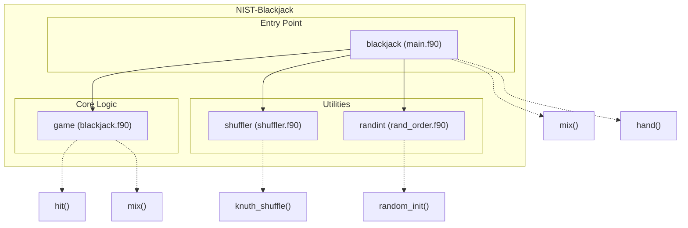

# NIST-Blackjack
## Testing
## Overview
NIST-Blackjack is a Fortran-based implementation of a simplified Blackjack game designed to simulate and evaluate hands while managing card shuffling and gameplay logic. The repository provides a clean and modular approach to modeling the game, focusing on core game mechanics such as card dealing, hand evaluation, and shuffling with an emphasis on correctness and simplicity. The simulation leverages the Knuth (Fisher-Yates) shuffle algorithm for randomization and includes optional debug functionality for controlled testing.

## Key Features
- **Complete Blackjack Gameplay Simulation**: Implements card dealing, hand evaluation, and game outcome logic in compliance with standard Blackjack rules.
- **Knuth Shuffle Algorithm**: Ensures high-quality randomization of the deck using the Knuth (Fisher-Yates) shuffle.
- **Modular Design**: Core functionalities are encapsulated in separate modules for improved readability and maintainability.
- **Debug Mode**: Optional debug mode for manual input and enhanced output for testing purposes.
- **Cross-Language Compatibility**: Interoperability with C for randomization and utility functions.
- **Command-Line Integration**: Supports command-line arguments for customizable configuration (e.g., enabling debug mode).
- **Testing and CI Support**: Includes test files and CI configurations to ensure code reliability and correctness.

# Layout and Architecture
```
# File Tree with Brief Comments

└── 54f883c8-019f-46a1-b9f3-ce9b9318d700
    └── NIST-Blackjack  # Main project repository.
        ├── .github
        │   └── workflows
        │       └── ci.yml  # GitHub Actions for CI/CD.
        ├── CMakeLists.txt  # CMake build configuration.
        ├── CMakePresets.json  # Preset configurations for CMake.
        ├── LICENSE  # License for the project.
        ├── README.md  # Project description and instructions.
        ├── app  # Main application programs.
        │   ├── main.f90  # Blackjack simulation program.
        │   └── rand_order.f90  # Random number generator program for integer lists.
        ├── fpm.toml  # Fortran package manager configuration.
        ├── meson.build  # Meson build configuration.
        ├── src  # Core source code modules.
        │   ├── blackjack.c  # C bindings for Blackjack game.
        │   ├── blackjack.f90  # Core logic of Blackjack (game mechanics).
        │   └── shuffler.f90  # Knuth shuffle implementation.
        └── tests  # Test-related files.
            ├── test_hit.cmake  # CMake tests for the hit subroutine.
            ├── test_hit.py  # Python tests for the hit subroutine.
            └── y.asc  # Test data or key file (purpose unclear).
```




## Usage Examples

### Build

To build the project, create a build directory, configure with `cmake` or `meson`, and compile:

#### Using CMake
```bash
mkdir build
cd build
cmake ..
make
```

#### Using Meson
```bash
meson setup builddir
meson compile -C builddir
```

### Test

To run the test suite (e.g., `ctest`), execute the following commands from the build directory:
```bash
ctest
```

Alternatively, you can run Python or CMake tests for specific modules like `hit`:
```bash
python3 tests/test_hit.py
```

```bash
cmake --build . --target test_hit
```

### Run

#### Running the Blackjack game
Use the following command to simulate a Blackjack game:
```bash
./build/app/main
```
To enable debug mode for additional outputs and custom card inputs, pass `-d` as a command-line argument:
```bash
./build/app/main -d
```

#### Running the `rand_order` program
You can shuffle and print integers from 1 to N using:
```bash
./build/app/rand_order <N>
```
Replace `<N>` with a positive integer, e.g., `./build/app/rand_order 10`.

### Core Feature Examples

#### Shuffling a deck of cards
The deck is shuffled using the `mix` subroutine, which employs the Knuth shuffle algorithm. Example usage:
```fortran
call mix(cards)
! 'cards' is an integer array of size 52 representing the deck
```

#### Simulating a Blackjack hand
A Blackjack hand can be simulated using the `hand` function:
```fortran
win = hand(cards)
! 'cards' is the shuffled deck; 'win' indicates the result
! win = 1 for player win, 2 for push, and 0 for dealer win or bust
```

#### Hitting during a game
To handle drawing a card during the game, use the `hit` subroutine:
```fortran
call hit(total, aces, position, cards)
! 'total' and 'aces' are updated with new card; 'position' is incremented
```

### Additional Notes

- **Random Initialization**: Ensure to initialize the random number generator before invoking any shuffling or gameplay logic:
  ```fortran
  call random_init(.false., .false.)
  ```

- **Debug Mode**: The `debug` flag in the `game` module enables manual card inputs and additional outputs. Set this flag to `.true.` for debugging:
  ```fortran
  debug = .true.
  ```


# Key Feature Implementation Deep Dive

## 1. Blackjack Game Logic (`hand` function)
The `hand` function is at the core of the Blackjack game simulation. It handles player and dealer actions, evaluates scores, and determines the result of a game round. Key aspects include:
- **Initialization**: Sets initial scores for both the player (`P`) and dealer (`D`) to 0. It also initializes ace count trackers (`PACE` for player and `DACE` for dealer) and card indices.
- **Player Actions**: Draws cards for the player until they either choose to stop (via input if debug mode is enabled) or exceed 21, at which point the player loses.
- **Dealer Actions**: Draws cards until the dealer's score exceeds 16 or they bust (score > 21).
- **Win Determination**: Compares player and dealer scores to declare a winner or identify a push (tie).
The function utilizes the `hit` subroutine for drawing cards and updating totals.

## 2. Card Drawing and Handling (`hit` subroutine)
The `hit` subroutine is responsible for simulating card draws and updating scores:
- **Total Update**: Adds the drawn card's value to the player's or dealer's total score.
- **Ace Handling**: Keeps track of aces drawn and adjusts their values dynamically—an ace is valued at 1 instead of 11 if the score exceeds 21.
- **Debug Support**: When debugging is enabled, it allows users to manually input card values.

## 3. Card Shuffle (`mix` subroutine)
The `mix` subroutine initializes and shuffles a standard deck of 52 cards. It:
- **Deck Initialization**: Creates an integer array representing a deck with card values (2 to 11, where 11 represents an ace).
- **Shuffling**: Calls the `knuth_shuffle` subroutine from the `shuffler` module to randomize the order of cards.

## 4. Knuth Shuffle Implementation (`knuth_shuffle` subroutine)
The Knuth shuffle (Fisher-Yates shuffle) ensures a fair and unbiased randomization of the card deck:
- **Algorithm**: Iterates backward over the array and swaps the current element with a randomly selected earlier index. The randomness is based on Fortran's `random_number` intrinsic function.
- **Integration**: This subroutine is used by `mix` to shuffle the deck seamlessly.

## 5. Program Initialization (`random_init` in `rand_order.f90` and `main.f90`)
Though not fully read here, `random_init` is likely responsible for initializing the random number generator:
- **Seed Management**: Ensures consistency in randomization (e.g., repeatable vs. system time-based seeding).
- **Usage**: Called before shuffling operations to ensure robust randomness for card shuffling and gameplay.

## Interactions Between Features
- The `mix` subroutine relies on the `knuth_shuffle` subroutine to shuffle the deck.
- The `hand` function and `hit` subroutine are tightly integrated, with `hit` enabling dynamic scoring and game progression.
- Debugging capabilities span multiple features, providing manual control and detailed insights for testing purposes.

This modular structure promotes code reusability and enables incremental improvements. Enhancements could include expanding debugging options, introducing more sophisticated shuffle mechanisms, or adding new game rules for variability.


# Implemented User Stories

## Core Features of the Blackjack Game
- [ ] **As a player**, I want to play a game of simplified blackjack with automated dealing of cards, so that I can simulate a realistic blackjack game, which requires implementing the core `hand` functionality.
- [ ] **As a player**, I want to receive the outcome of the game (win, dealer win, or push), so that I can determine the result of my blackjack hand, which requires calculating player and dealer totals and comparing.
- [ ] **As a player**, I want to choose whether to hit or stand during my turn, so that I can control my gameplay strategy, which requires manual input handling during the match.
- [ ] **As a player**, I want to automatically calculate the value of my hand, including proper Ace handling, so that I can understand my current standing in the game, which requires the `hit` subroutine to manage this during gameplay.
- [ ] **As a dealer (automated role)**, I want rules to dictate when to draw or stand, so that my actions follow casino blackjack regulations, which requires game logic in the `hand` function.

## Shuffling Mechanisms
- [ ] **As a developer**, I want a shuffling mechanism to randomize the order of cards in the deck, so that the game ensures fairness and unpredictability, which requires implementing the `mix` function using the Knuth Shuffle algorithm.
- [ ] **As a developer**, I want the shuffling algorithm to be reusable for other use cases, so that it can serve applications beyond blackjack, which requires modularizing the `knuth_shuffle` subroutine in the `shuffler` module.

## Debugging and Testing Features
- [ ] **As a player (debug mode)**, I want to input the value of the next card during my turn, so that I can simulate specific scenarios and test strategies, which requires enabling debug mode.
- [ ] **As a developer**, I want debug logs to print intermediate steps (e.g., card values, decisions) during gameplay, so that I can trace errors and validate game logic, which requires a `debug` flag in methods like `hit` and `hand`.
- [ ] **As a tester**, I want an automated testing script for the `hit` subroutine, so that I can validate its correctness with predefined scenarios, which requires Python and CMake testing frameworks.

## Command-Line Interface
- [ ] **As a user**, I want a command-line interface to launch the blackjack simulation, so that I can run the executable program from a terminal, which requires providing `main.f90` and `rand_order.f90` programs.
- [ ] **As a user**, I want the option to enable debug mode via command-line arguments, so that I can easily switch between simulation and testing modes, which requires handling the `-d` flag in `main.f90`.

## Cross-Language Compatibility
- [ ] **As a developer**, I want a Fortran implementation of the blackjack game, so that it leverages Fortran's numerical computation strengths, which requires using `blackjack.f90`.
- [ ] **As a developer**, I want a C implementation of the blackjack game, so that it is interoperable with existing C projects, which requires providing `blackjack.c` bindings to Fortran.
- [ ] **As a developer**, I want clean bindings between Fortran and C, so that the code remains modular and reusable, which requires `bind(c)` for interoperability.

## Build and Installation
- [ ] **As a developer**, I want build scripts for compiling the project on various systems, so that contributors can easily start development, which requires providing CMake and Meson configurations.
- [ ] **As a developer**, I want to generate and execute the blackjack program binaries with a single command, so that I can seamlessly test the program, which requires proper build steps documented in the README.

## Documentation and Licensing
- [ ] **As an engineer**, I want clear documentation of how the blackjack game works and how to build it, so that I can quickly understand and contribute to development, which requires a comprehensive README file.
- [ ] **As a user**, I want licensing information to be included, so that I understand the terms of usage and redistribution, which requires the LICENSE file in the repository.


# Dependencies


## Intrinsic

Standard Fortran intrinsic modules and functions.
- **iso_fortran_env**
  - `ALL`
- **iso_c_binding**
  - `c_int`
## Internal

Modules and functions defined within this project that are accessed in a different module or program.
- **shuffler**
  - `knuth_shuffle`
- **game**
  - `debug`
  - `hand`
  - `mix`
## External Functions

External (non-Fortran, bound with the C ABI) functions called by this project.
- `hit`
- `knuth_shuffle`
- `mix`
